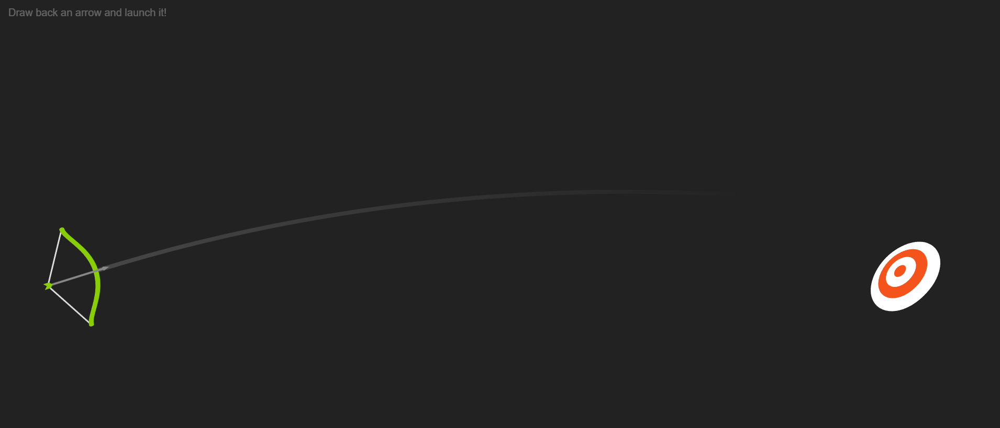
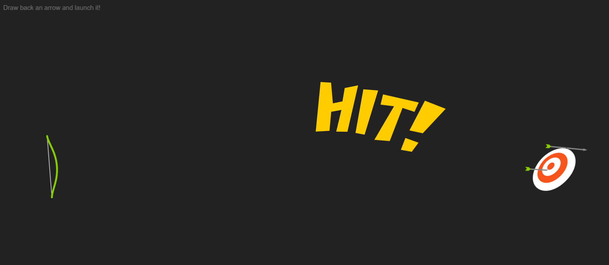
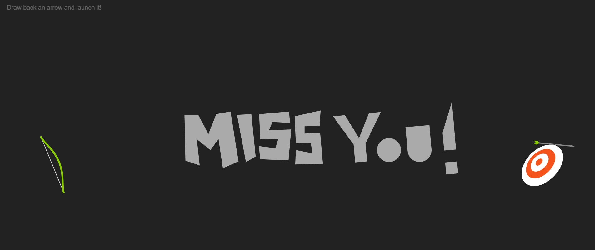

# 🎯 Arrow Game

A simple and fun reflex-based arrow key game built using pure HTML, CSS, and JavaScript — all in a single file: `index.html`.

**🕹️ Live Demo:**  
[https://anuj0224.github.io/arrow-game/](https://anuj0224.github.io/arrow-game/)

---

## 📸 Screenshots

| Start Screen | Success | Minor Up and Down | Miss the target |
|--------------|--------------|----------------|-------------|
|  |  |  |  |

---

## 📌 How to Play

- Arrows will appear one at a time (⬆️ ⬇️ ⬅️ ➡️).
- Press the **matching arrow key** quickly.
- Score increases on each correct input.
- Wrong input or timeout ends the game.

---

## 📁 File Structure

```

arrow-game/
├── demo/
│   ├── screen1.png
│   ├── screen2.png
│   ├── screen3.png
│   └── screen4.png
└── index.html

````

---

## 🛠️ How to Run Locally

1. Clone the repo:
```bash
git clone https://github.com/anuj0224/arrow-game.git
cd arrow-game
````

2. Open `index.html` in your browser.

---

## 👨‍💻 Author

Made with ❤️ by [Anuj Mourya](https://github.com/anuj0224)

